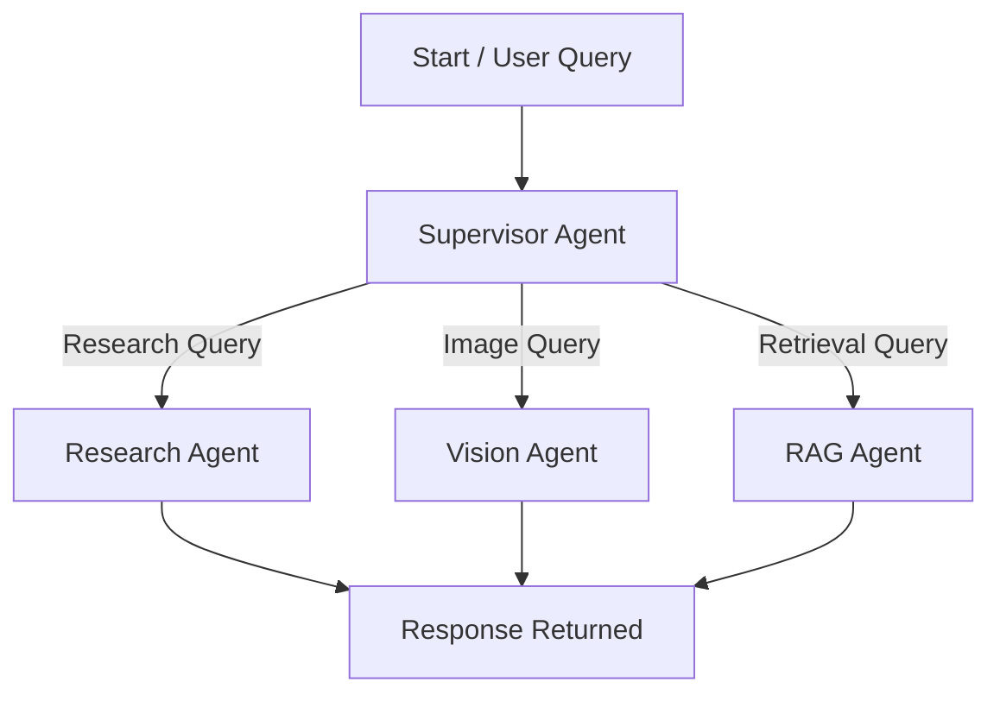

# Personal AI Assistant

<div align="center">
  
  
  
  
</div>

<div align="center">
  <h3>🤖 Next-Generation AI Assistant for Enhanced Productivity</h3>
</div>

**Personal AI Assistant** is a next-generation, cross-platform digital assistant that brings the power of advanced AI directly to your fingertips. Built with a seamless blend of React Native (Expo) for the frontend and FastAPI for the backend, this project is more than just a chatbot—it's a smart, extensible platform for intelligent productivity.

Harnessing state-of-the-art large language models (LLMs) and a modular, agent-based backend, the assistant can:
- Answer complex questions and perform research using real-time web search and retrieval-augmented generation (RAG).
- Analyze and summarize documents (PDFs) by extracting their semantic meaning and storing them for instant, context-aware retrieval.
- Understand and interpret images using cutting-edge vision models.
- Securely manage user authentication and API keys, ensuring privacy and safety.
- Scale across devices, supporting iOS, Android, and web with a unified codebase.

Whether you're a student, researcher, or professional, this assistant is designed to help you automate knowledge work, manage information overload, and interact with AI in a natural, conversational way. The backend's innovative use of a stateful graph (LangGraph) allows for dynamic routing of tasks to specialized agents, making the system both powerful and easily extensible for future features.

## 🎥 Demo Video

<div align="center">
  <video src="./assets/demo.mp4" controls width="400" style="border-radius: 10px; box-shadow: 0 4px 8px rgba(0,0,0,0.1);">
    Your browser does not support the video tag.
  </video>
</div>

<div align="center">
  <i>If the video doesn't play, you can <a href="./assets/demo.mp4">download it here</a>.</i>
</div>

## ✨ Features

### 🎯 Frontend (React Native/Expo)
- 📱 Modern, responsive mobile-first UI
- 💬 Real-time chat interface with AI assistant
- 📄 Document upload and processing capabilities
- 🖼️ Image upload and analysis
- 🔐 User authentication and profile management
- 🔑 Secure API key management
- 🌐 Cross-platform support (iOS, Android, Web)

### 🚀 Backend (FastAPI)
- 🔄 RESTful API architecture
- 🔒 Secure user authentication with JWT
- 📑 PDF document processing and analysis
- 🖼️ Image processing and storage
- 🤖 Integration with AI models (Groq)
- 📊 Vector database integration (Pinecone)
- 🌐 CORS support for cross-origin requests

## 🏗️ Backend Architecture

The backend is designed as a modular, agent-based system using FastAPI and LangGraph. It features a stateful graph that routes user queries to specialized agents for research, image analysis, and retrieval-augmented generation (RAG).

### 📁 Structure
- **main.py**: Defines API endpoints and integrates the agent graph.
- **app/graph/graph.py**: Sets up the flow of tasks using a stateful graph, routing between supervisor, researcher, vision, and RAG agents.
- **app/agents/**: Contains logic for each agent:
  - `supervisor`: Decides which agent should handle the next step.
  - `research_agent`: Handles research and web search tasks.
  - `vison_agent`: Handles image analysis.
  - `rag_agent`: Handles retrieval-augmented generation (semantic search).
- **app/utils.py**: Handles PDF processing and Pinecone upsert.
- **models/**: Contains the sentence-transformer model and config for semantic search.

### 🔥 Features
- **🔐 User Authentication**: Secure signup, login, and JWT-based session management.
- **💬 AI-Powered Chat**: Handles user queries using a modular agent-based graph (LangGraph) with LLMs (Groq).
- **📄 Document Processing**: Accepts PDF uploads, processes them, and stores semantic vectors in Pinecone for retrieval.
- **🖼️ Image Analysis**: Accepts image uploads, encodes and analyzes them using a vision LLM.
- **🔑 API Key Management**: Securely updates and stores API keys.
- **🌐 CORS Support**: Allows cross-origin requests for frontend-backend integration.

### 📊 Backend Flow Diagram



## 🛠️ Tech Stack

### 🎨 Frontend
- React Native/Expo
- TypeScript
- React Navigation
- Expo Router
- AsyncStorage for local data persistence
- Axios for API communication
- Various Expo modules for enhanced functionality

### ⚙️ Backend
- FastAPI
- SQLite database
- JWT authentication
- Python-based AI processing
- Pinecone for vector storage
- File system operations for document/image handling

## 📋 Prerequisites

- Node.js (v14 or higher)
- Python 3.8+
- Expo CLI
- Groq API key
- Pinecone account and API key

## 🚀 Installation

### Frontend Setup
1. Navigate to the app directory:
   ```bash
   cd app
   ```

2. Install dependencies:
   ```bash
   npm install
   ```

3. Start the development server:
   ```bash
   npm start
   ```

### Backend Setup
1. Navigate to the backend directory:
   ```bash
   cd backend
   ```

2. Create a virtual environment:
   ```bash
   python -m venv venv
   source venv/bin/activate  # On Windows: venv\Scripts\activate
   ```

3. Install dependencies:
   ```bash
   pip install -r requirements.txt
   ```

4. Start the FastAPI server:
   ```bash
   uvicorn main:app --reload
   ```

## ⚙️ Environment Variables

### Frontend
Create a `.env` file in the app directory with:
```
API_URL=your_backend_url
```

### Backend
Create a `.env` file in the backend directory with:
```
GROQ_API_KEY=your_groq_api_key
PINECONE_API_KEY=your_pinecone_api_key
```

## 🔌 API Endpoints

- `POST /signup` - User registration
- `POST /login` - User authentication
- `GET /users/me` - Get current user info
- `POST /chat` - Chat with AI assistant
- `POST /upload-image` - Upload and process images
- `POST /process-pdf` - Process PDF documents
- `POST /update-api-key` - Update API keys

## 🤝 Contributing

1. Fork the repository
2. Create your feature branch
3. Commit your changes
4. Push to the branch
5. Create a new Pull Request

## 📄 License

This project is licensed under the MIT License - see the LICENSE file for details. 